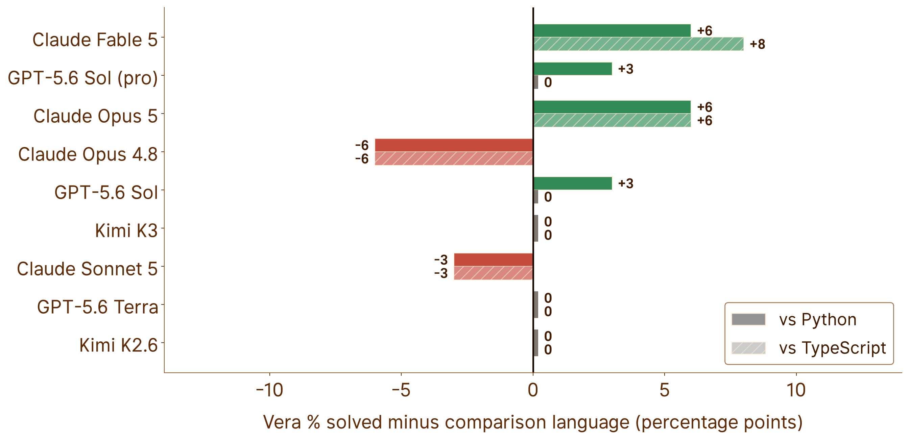
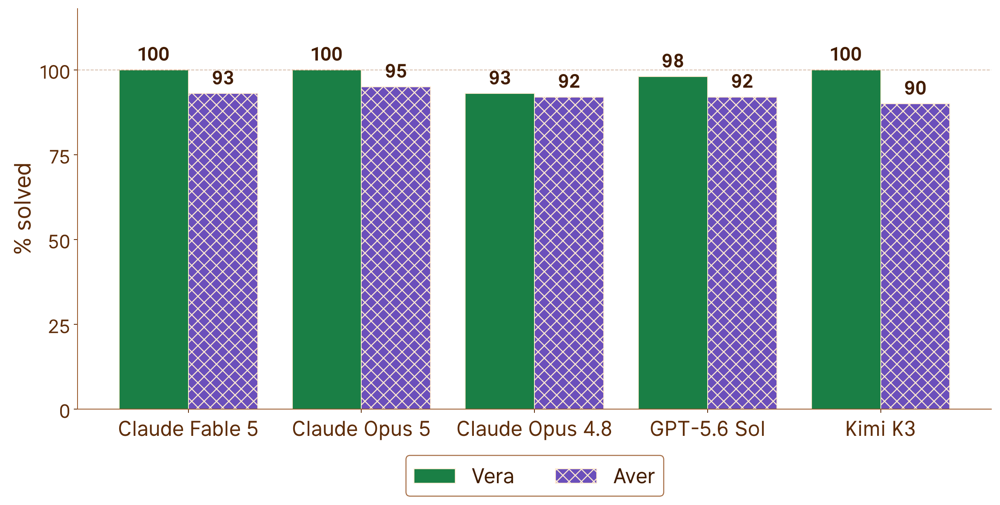
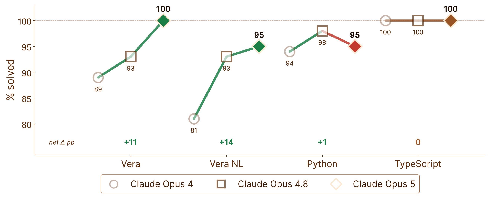
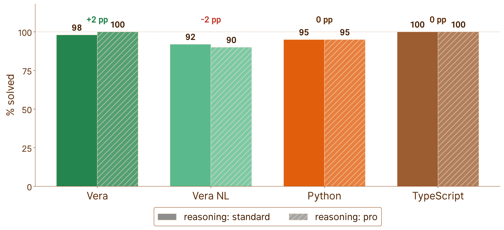
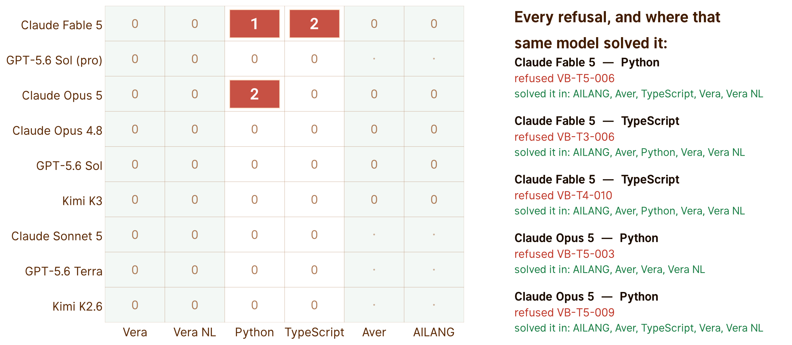
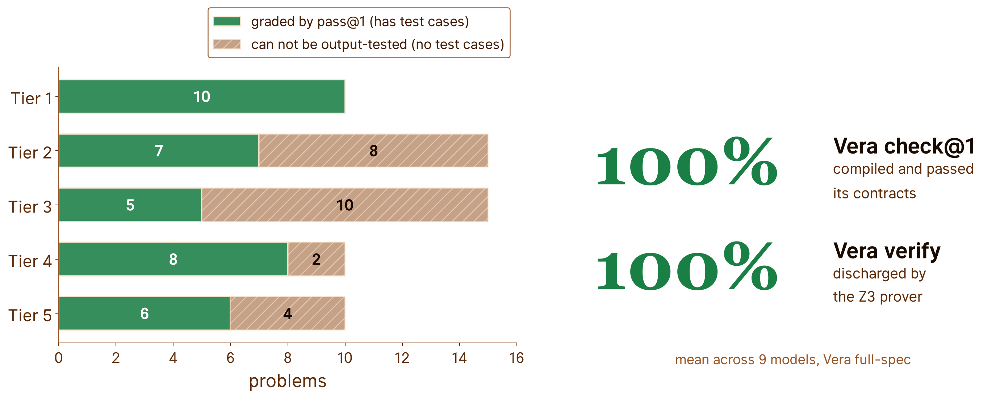

# VeraBench

[](https://veralang.dev)

[](https://github.com/aallan/vera-bench/actions/workflows/ci.yml)
[](https://codecov.io/gh/aallan/vera-bench)

A benchmark for evaluating LLM code generation in [Vera](https://github.com/aallan/vera), a programming language designed for large language models (LLMs) to write.

## Results

Nine models, three providers, 60 problems across five difficulty tiers, run
against [Vera v0.1.7](https://github.com/aallan/vera/releases/tag/v0.1.7).
Every score chart below reports **% solved**: the model wrote code, it
compiled, it ran, and the output matched. A refusal, a compile failure, a crash
and a wrong answer all count the same way, as not solved. The one exception is
the coverage chart, which counts problems rather than scoring them.

The ideas behind Vera appear to work. Models with no training data in the
language now write it about as well as they write Python, the design choice
that looks most hostile to human authors is the one they reward, and every new
model does better than the last.

### Vera holds its own



Green is a win for Vera. It wins outright for four of the nine models and
draws level with three more, and the wins sit with the newest models on the
board.

The margin is about one problem, so the lead is narrow. The deficit is what
has gone: a language no model has ever seen no longer costs them anything.
Nine months ago this chart was almost entirely red, and the worst case solved
seventeen percentage points fewer problems in Vera than in Python.

### Removing variable names was the right call



This is the closest the benchmark gets to a controlled experiment. Vera and
[Aver](https://github.com/jasisz/aver) are both languages no model was trained
on, both statically typed, both learned from a single document supplied in the
prompt. Neither gets the advantage of familiarity, so familiarity cannot
explain a difference between them.

What separates them is that Vera has no variable names at all. It uses typed
slot references, where Aver uses ordinary bindings. Vera wins on every model
tested, and not one of them does better with names than without them. Of all
the decisions in the language, dropping identifiers is the one that reads as
most obviously hostile to a human reader, and it is the one the models reward.

### The direction of travel



Each new flagship writes Vera better than the one before it, in both the
full-spec mode and the harder spec-from-NL mode where the model has to write
its own contracts before it writes any code. Over the same period the two
mainstream languages have stopped moving.

Only the last step is properly controlled, because the earlier one spans a
compiler, a standard library and a revision of the teaching document, so it
measures Vera and the models improving together. The controlled step points
the same way. The newest model is the first in this benchmark to write Vera
better than it writes Python.

### It is the structure, not the compute



One model, two reasoning budgets, the same problems. Deliberation is the only
thing that changes.

Nothing changes. Whatever stops these models solving the last two or three
problems, more thinking time is not the answer to it, and that holds in Python
as firmly as it does in Vera. Vera's advantage, where it has one, comes from
the structure in the language rather than from giving the model longer to
reconstruct that structure for itself.

### An effect nobody designed for



Models sometimes decline to answer. Every refusal in this sweep happened in
Python or TypeScript, and none at all in Vera, and in each case the same model
went on to solve the same problem in four or five other languages. The
problems concerned were things like dividing two numbers and guarding against
a zero divisor.

The refusals came from the two models that ship cybersecurity classifiers, and
not from the two models by the same vendor that do not. One reading is that the
strictest safety tuning is also the most prone to false positives, and that in
this sweep those false positives fired only in the languages the models had
read. Five refusals from two models is far too small a sample to establish
that, and a language nobody trained on may simply not have been exercised hard
enough to trip anything. It is a side effect rather than a design goal, and it
points somewhere worth measuring properly.

### What the headline number misses



Two fifths of the problem set has no test cases, and the reason is mechanical:
most of those problems take a list, a tree or an algebraic data type as an
argument, and the runner passes arguments on a command line. There is no way
to hand one to them.

Those problems are concentrated in the tiers built around data types,
exhaustive matching and effect handlers, which is precisely the machinery
Vera's contracts and prover exist to check. So the number every chart here
leads with is blind to the part of the benchmark Vera was designed for, and it
grades everyone on the subset that suits Python best. Vera checks and verifies
those problems anyway, and the models get essentially all of them right.

### Full results

| Model | Vera | Vera spec-from-NL | Python | TypeScript |
|---|---|---|---|---|
| Claude Fable 5 | **100%** | 97% | 94% | 92% |
| GPT-5.6 Sol (pro) | **100%** | 92% | 97% | 100% |
| Claude Opus 5 | **100%** | **100%** | 94% | 94% |
| Claude Opus 4.8 | 94% | 94% | 100% | 100% |
| GPT-5.6 Sol | **100%** | 94% | 97% | 100% |
| Kimi K3 | **100%** | 97% | 100% | 100% |
| Claude Sonnet 5 | 97% | 89% | 100% | 100% |
| GPT-5.6 Terra | **100%** | 94% | 100% | 100% |
| Kimi K2.6 | **100%** | 94% | 100% | 100% |

Every chart in this section, and several that did not make it, are described
in [assets/README.md](assets/README.md) with the command that regenerates
them.

> **On reading these numbers.** Single run per model, no pass@k. LLM output is
> non-deterministic and individual problems flip between runs. With 36
> gradeable problems one problem is worth 2.8 percentage points, so most of
> the gaps above are one or two problems wide and the benchmark is close to
> the point where it can no longer separate the models at the top. Harder
> problems are the next piece of work.

### Why this matters: zero training data

No LLM has ever been trained on Vera. There are no Vera examples on GitHub, no
Stack Overflow answers, no tutorials; the language was created after these
models' training cutoffs. Every token of Vera in these results was written by
a model that learned the language at evaluation time, from a single document
([SKILL.md](https://veralang.dev/SKILL.md)) in the prompt.

Python and TypeScript are at the other extreme, among the most heavily
represented languages in any training corpus. Models still write Vera as well
as they write either of them. That gap in exposure, and the absence of any
corresponding gap in the results, is the argument: language design appears to
matter more than how much of the language a model has read.


## Overview

VeraBench measures whether LLMs write better code in a language designed for them. Vera uses typed slot references instead of variable names, mandatory contracts, and explicit algebraic effects — all features that should make LLM-generated code more verifiable.

The benchmark covers five difficulty tiers:

| Tier | Focus | What it tests |
|------|-------|--------------|
| 1 | Pure arithmetic | Basic syntax, `@T.n` slot references, simple contracts |
| 2 | String & array ops | Built-in function discovery (`domain_verb` naming) |
| 3 | ADTs & match | Data type definition, De Bruijn indices in match arms |
| 4 | Recursion & termination | `decreases` clauses, Z3 verification |
| 5 | Multi-function & effects | IO, State, Exn, effect propagation across functions |

For each problem, we measure:

- **% solved (pass@1)** — The headline. Solved over the problems that can be
  output-graded, where a refusal, a compile failure, a runtime error and a
  wrong answer all count alike as not solved.
- **check@1** — Does the code pass `vera check` on first attempt?
- **verify@1** — Does it pass `vera verify` (Z3 contract verification)?
- **fix@1** — Given the error message, can the model fix it in one turn?
- **run_correct** — Does execution produce the correct output? Measured only
  over attempts that compiled, so it is not comparable across models that
  refuse or fail to compile at different rates. That is why the charts report
  % solved instead.

The same problems are also run in Python, TypeScript, [Aver](https://github.com/jasisz/aver), and [AILANG](https://ailang.sunholo.com/) as baselines. AILANG and Aver are zero-training-data languages, providing additional data points alongside Vera for the language-design-vs-training-data thesis.

> **Cross-language comparison:** For cross-language headline rates, use the T1–T4 aggregate. Tier 5 tests Vera's algebraic effect handlers, which other languages solve with fundamentally different native idioms. See [#50](https://github.com/aallan/vera-bench/issues/50).

## Prerequisites

* Python 3.11+
* Git
* Node.js 22+ *(optional, for TypeScript baselines and generation)*
* [Aver](https://github.com/jasisz/aver) *(optional, for Aver baselines and generation)*
* [AILANG](https://ailang.sunholo.com/) *(optional, for AILANG baselines and generation)*

## Installation

```bash
git clone https://github.com/aallan/vera-bench.git
cd vera-bench
python -m venv .venv
source .venv/bin/activate
pip install -e ".[llm]"
```

The `[llm]` extra installs the Anthropic and OpenAI SDKs. Use `pip install -e .` if you only need validation (no model evaluation).

### Install the Vera compiler

The `vera` command must be available on `$PATH`. Install it anywhere into the same environment, either from a local clone,

```bash
pip install -e /path/to/vera          
```

or directly from GitHub.

```bash
pip install git+https://github.com/aallan/vera.git   
```
Afterwards you should be able to print the Vera version from the terminal,

```bash
vera version   
```

this should return v0.1.6 or later. Vera 0.1.x changed several semantics the
benchmark depends on, so older compilers will fail validation.

## Running the benchmark

`vera-bench validate` checks all 60 problems and every canonical solution — run it first:

```bash
vera-bench validate
```

A single model against the Vera problems (full-spec mode) is one command:

```bash
export ANTHROPIC_API_KEY=sk-ant-...
vera-bench run --model claude-sonnet-5
```

`vera-bench run` writes one JSONL row per problem attempt to `results/`, and has **no resume** — it unlinks its output file at startup. It's the primitive; you don't drive a full multi-model run with it directly.

### The full sweep

A real run evaluates the whole model matrix — defined once in [`vera_bench/matrix.py`](vera_bench/matrix.py) and read by everything below — across every language target, and the workflow is shaped by the fact that LLM APIs are slow and flaky. Four scripts, used in order:

**1. Gate before you spend.** [`preflight.sh`](scripts/preflight.sh) checks every model id, provider auth, the request parameters each model accepts, and the Vera / Aver / AILANG toolchains — one problem per check. A couple of dollars against a sweep that is hours:

```bash
bash scripts/preflight.sh
```

**2. Run the sweep.** [`run_sweep.sh`](scripts/run_sweep.sh) runs the whole matrix (every model × its targets) in one terminal, provider streams concurrent. It is **idempotent**: it skips any target already on disk and clean and re-runs the rest, so a killed or rate-limited sweep is recovered simply by running it again. The expensive pro tier is opt-in:

```bash
export ANTHROPIC_API_KEY=... OPENAI_API_KEY=... MOONSHOT_API_KEY=...
SWEEP_INCLUDE_PRO=1 bash scripts/run_sweep.sh
```

Its terminal goes quiet mid-target — it pipes each run through `tee`, and the progress bar blanks when it's not on a real terminal. That's expected, not a hang; watch it with the next tool instead.

**3. Watch the scoreboard.** [`sweep_status.py`](scripts/sweep_status.py) reads the JSONL rows directly — the only reliable live signal — and separates a **transient** failure that should be re-run (rate-limit, timeout, empty content) from a **real result** that should be kept (a refusal, a compile error, a wrong answer):

```bash
SWEEP_INCLUDE_PRO=1 python scripts/sweep_status.py
```

**4. Repair transient failures surgically.** When a target is complete except for a few blips, [`rerun_failed.py`](scripts/rerun_failed.py) re-runs *only those problems* and splices them back, instead of re-running all 60 (drop `--apply` to preview):

```bash
python scripts/rerun_failed.py --model moonshot/kimi-k2.6 --mode full-spec --apply
```

Loop steps 3–4 until the scoreboard reads all-clean. See [`scripts/README.md`](scripts/README.md) for the full stage breakdown, env tunables, and the infrastructure-vs-model definition of "clean".

### Baselines

Canonical-solution reference runs — no model, no API key, one per comparison language:

```bash
vera-bench baselines                        # python (default)
vera-bench baselines --language typescript
vera-bench baselines --language aver
vera-bench baselines --language ailang
```

### Targeted runs

For iterating on one problem or mode rather than a full sweep:

```bash
vera-bench run --model claude-sonnet-5 --tier 1            # one tier
vera-bench run --model claude-sonnet-5 --problem VB-T1-001 # one problem
vera-bench run --model claude-sonnet-5 --mode spec-from-nl # agent writes its own contracts
vera-bench run --model claude-sonnet-5 --language python   # Python (or typescript/aver/ailang)
vera-bench run --model moonshot/kimi-k2.6 --parallel 10    # concurrent dispatch for slow models
```

Supported providers: [Anthropic](https://anthropic.com) (Claude), [OpenAI](https://openai.com) (GPT), [Kimi](https://platform.kimi.ai) (Moonshot), and [OpenRouter](https://openrouter.ai/). Set the matching key (`ANTHROPIC_API_KEY`, `OPENAI_API_KEY`, `MOONSHOT_API_KEY`, or `OPENROUTER_API_KEY`).

The Vera language reference ([SKILL.md](https://veralang.dev/SKILL.md)) is fetched from veralang.dev at run time. Use a local copy — e.g. for testing unreleased language features — with `--skill-md /path/to/SKILL.md`.

## Report generation

Running `vera-bench report results/` generates `results/summary.md` with a summary table, per-tier breakdowns, and per-problem detail. Each `vera-bench run` writes incremental JSONL results (one line per problem attempt), so a run that stops early is still reportable up to the problem it reached.

The headline chart comes from [`scripts/plot_results.py`](scripts/plot_results.py) — **% solved** (pass@1) per model × mode over the gradeable problem set. [`scripts/README.md`](scripts/README.md) documents it plus the 16:9 talk-slide renderer.

> **There is no resume.** `vera-bench run` deletes any existing output file for that model × language × mode before it starts, so re-running an interrupted target repeats it from problem 1 rather than topping it up. Filenames carry no timestamp, so the old results are gone. Budget a full re-run for any target that does not finish.

Results files are in `.gitignore` — they are generated artifacts, not checked in.

## Prior art

VeraBench is inspired by:

- [HumanEval](https://github.com/openai/human-eval) — 164 Python function completion problems
- [MBPP](https://github.com/google-research/google-research/tree/master/mbpp) — 974 Python problems from natural language
- [DafnyBench](https://github.com/sun-wendy/DafnyBench) — 782 Dafny verification annotation problems

DafnyBench demonstrated that tracking verification success rates over time attracts genuine research attention — success rates went from 68% to 96% across model generations in under two years. VeraBench aims to create the same longitudinal story for a language designed from scratch for LLM code generation.

## Citation

```bibtex
@software{verabench2026,
  author = {Allan, Alasdair},
  title = {VeraBench: a benchmark suite for LLM code generation in Vera},
  year = {2026},
  url = {https://github.com/aallan/vera-bench}
}
```

## License

VeraBench is licensed under the [MIT License](LICENSE).

Copyright © 2026 Alasdair Allan

Permission is hereby granted, free of charge, to any person obtaining a copy of this software and associated documentation files (the "Software"), to deal in the Software without restriction, including without limitation the rights to use, copy, modify, merge, publish, distribute, sublicense, and/or sell copies of the Software, and to permit persons to whom the Software is furnished to do so, subject to the following conditions:

The above copyright notice and this permission notice shall be included in all copies or substantial portions of the Software.

THE SOFTWARE IS PROVIDED "AS IS", WITHOUT WARRANTY OF ANY KIND, EXPRESS OR IMPLIED, INCLUDING BUT NOT LIMITED TO THE WARRANTIES OF MERCHANTABILITY, FITNESS FOR A PARTICULAR PURPOSE AND NONINFRINGEMENT. IN NO EVENT SHALL THE AUTHORS OR COPYRIGHT HOLDERS BE LIABLE FOR ANY CLAIM, DAMAGES OR OTHER LIABILITY, WHETHER IN AN ACTION OF CONTRACT, TORT OR OTHERWISE, ARISING FROM, OUT OF OR IN CONNECTION WITH THE SOFTWARE OR THE USE OR OTHER DEALINGS IN THE SOFTWARE.
