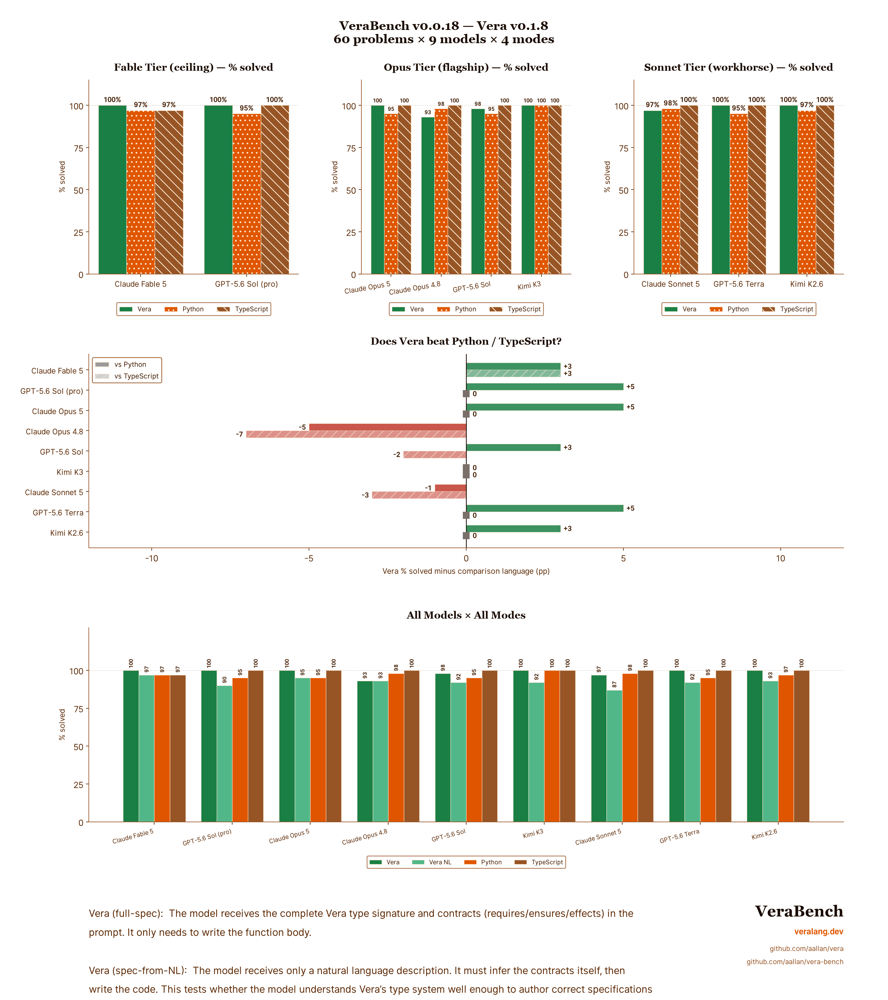

# VeraBench

[](https://veralang.dev)

[](https://github.com/aallan/vera-bench/actions/workflows/ci.yml)
[](https://codecov.io/gh/aallan/vera-bench)

A benchmark for evaluating LLM code generation in [Vera](https://github.com/aallan/vera), a programming language designed for large language models (LLMs) to write.

## Results



Results from [VeraBench v0.0.7](https://github.com/aallan/vera-bench/releases/tag/v0.0.7) against [Vera v0.0.108](https://github.com/aallan/vera/releases/tag/v0.0.108) across 50 problems, 6 models, and 4 modes per model.

### run_correct by model (Vera full-spec vs Python vs TypeScript)

**Flagship tier:**

| Model | Vera | Python | TypeScript |
|-------|------|--------|------------|
| **Kimi K2.5** | **100%** | 86% | 91% |
| GPT-4.1 | 91% | 96% | 96% |
| Claude Opus 4 | 88% | 96% | 96% |

**Sonnet tier:**

| Model | Vera | Python | TypeScript |
|-------|------|--------|------------|
| **Kimi K2 Turbo** | **83%** | 88% | 79% |
| Claude Sonnet 4 | 79% | 96% | 88% |
| GPT-4o | 78% | 93% | 83% |

### Key findings

**Kimi K2.5 writes perfect Vera code** — 100% run_correct on both full-spec and spec-from-NL modes, beating Python (86%) and TypeScript (91%). This is the first model where Vera is the best language across the board.

**Three models beat TypeScript on Vera.** Kimi K2.5 (+9pp), Kimi K2 Turbo (+4pp), and in our [initial v0.0.4 benchmark](https://github.com/aallan/vera-bench/releases/tag/v0.0.4) Claude Sonnet 4 also beat TypeScript (83% vs 79%). The pattern is consistent across providers: Vera's mandatory contracts and typed slot references provide enough structure to compensate for zero training data.

**Python remains the strongest target for most models.** Claude, OpenAI, and Moonshot all hit 86–96% run_correct on Python. The gap between Python and Vera varies from 0pp (Kimi K2.5 spec-from-NL: both 100%) to 17pp (Claude Sonnet 4: 96% vs 79%).

**Spec-from-NL is the harder test.** When models must infer their own contracts from natural language, performance drops for most models — GPT-4.1 falls from 91% to 50%. But Kimi K2.5 holds at 100%, suggesting it has internalised Vera's type system well enough to author specifications from scratch.

> **Note:** These are single-run results. LLM outputs are non-deterministic — individual problems can flip between pass and fail across runs. The v0.0.4 Claude Sonnet 4 result (83% Vera, 79% TypeScript) shifted to 79%/88% in the v0.0.7 re-run, illustrating this variance. Stable rates will require [pass@k](https://arxiv.org/abs/2107.03374) evaluation with multiple trials. This is early days — 50 problems, one run per model.

### Why this matters: zero training data

No LLM has ever been trained on Vera. There are no Vera examples on GitHub, no Stack Overflow answers, no tutorials — the language was created after these models' training cutoffs. Every token of Vera code in these results was written by a model that learned the language entirely from a single document ([SKILL.md](https://veralang.dev/SKILL.md)) provided in the prompt at evaluation time.

Python and TypeScript, by contrast, are among the most heavily represented languages in LLM training data — billions of lines of code, documentation, and Q&A. The fact that multiple models write *better* Vera than TypeScript despite this asymmetry suggests that language design matters more than training data volume. Vera's mandatory contracts, typed slot references, and explicit effect annotations give models enough structural guardrails that in-context instruction alone is sufficient — no pre-training required.

## Overview

VeraBench measures whether LLMs write better code in a language designed for them. Vera uses typed slot references instead of variable names, mandatory contracts, and explicit algebraic effects — all features that should make LLM-generated code more verifiable.

The benchmark covers five difficulty tiers:

| Tier | Focus | What it tests |
|------|-------|--------------|
| 1 | Pure arithmetic | Basic syntax, `@T.n` slot references, simple contracts |
| 2 | String & array ops | Built-in function discovery (`domain_verb` naming) |
| 3 | ADTs & match | Data type definition, De Bruijn indices in match arms |
| 4 | Recursion & termination | `decreases` clauses, Z3 verification |
| 5 | Multi-function & effects | IO, State, Exn, effect propagation across functions |

For each problem, we measure:

- **check@1** — Does the code pass `vera check` on first attempt?
- **verify@1** — Does it pass `vera verify` (Z3 contract verification)?
- **fix@1** — Given the error message, can the model fix it in one turn?
- **run_correct** — Does execution produce the correct output?

The same problems are also run in Python, TypeScript, [Aver](https://github.com/jasisz/aver), and [AILANG](https://ailang.sunholo.com/) as baselines. AILANG and Aver are zero-training-data languages, providing additional data points alongside Vera for the language-design-vs-training-data thesis.

> **Cross-language comparison:** For cross-language headline rates, use the T1–T4 aggregate. Tier 5 tests Vera's algebraic effect handlers, which other languages solve with fundamentally different native idioms. See [#50](https://github.com/aallan/vera-bench/issues/50).

## Prerequisites

* Python 3.11+
* Git
* Node.js 22+ *(optional, for TypeScript baselines and generation)*
* [Aver](https://github.com/jasisz/aver) *(optional, for Aver baselines and generation)*
* [AILANG](https://ailang.sunholo.com/) *(optional, for AILANG baselines and generation)*

## Installation

```bash
git clone https://github.com/aallan/vera-bench.git
cd vera-bench
python -m venv .venv
source .venv/bin/activate
pip install -e ".[llm]"
```

The `[llm]` extra installs the Anthropic and OpenAI SDKs. Use `pip install -e .` if you only need validation (no model evaluation).

### Install the Vera compiler

The `vera` command must be available on `$PATH`. Install it anywhere into the same environment, either from a local clone,

```bash
pip install -e /path/to/vera          
```

or directly from GitHub.

```bash
pip install git+https://github.com/aallan/vera.git   
```
Afterwards you should be able to print the Vera version from the terminal,

```bash
vera version   
```

this should return v0.1.6 or later. Vera 0.1.x changed several semantics the
benchmark depends on, so older compilers will fail validation.

## Running the benchmark

`vera-bench validate` checks all 60 problems and every canonical solution — run it first:

```bash
vera-bench validate
```

A single model against the Vera problems (full-spec mode) is one command:

```bash
export ANTHROPIC_API_KEY=sk-ant-...
vera-bench run --model claude-sonnet-5
```

`vera-bench run` writes one JSONL row per problem attempt to `results/`, and has **no resume** — it unlinks its output file at startup. It's the primitive; you don't drive a full multi-model run with it directly.

### The full sweep

A real run evaluates the whole model matrix — defined once in [`vera_bench/matrix.py`](vera_bench/matrix.py) and read by everything below — across every language target, and the workflow is shaped by the fact that LLM APIs are slow and flaky. Four scripts, used in order:

**1. Gate before you spend.** [`preflight.sh`](scripts/preflight.sh) checks every model id, provider auth, the request parameters each model accepts, and the Vera / Aver / AILANG toolchains — one problem per check. A couple of dollars against a sweep that is hours:

```bash
bash scripts/preflight.sh
```

**2. Run the sweep.** [`run_sweep.sh`](scripts/run_sweep.sh) runs the whole matrix (every model × its targets) in one terminal, provider streams concurrent. It is **idempotent**: it skips any target already on disk and clean and re-runs the rest, so a killed or rate-limited sweep is recovered simply by running it again. The expensive pro tier is opt-in:

```bash
export ANTHROPIC_API_KEY=... OPENAI_API_KEY=... MOONSHOT_API_KEY=...
SWEEP_INCLUDE_PRO=1 bash scripts/run_sweep.sh
```

Its terminal goes quiet mid-target — it pipes each run through `tee`, and the progress bar blanks when it's not on a real terminal. That's expected, not a hang; watch it with the next tool instead.

**3. Watch the scoreboard.** [`sweep_status.py`](scripts/sweep_status.py) reads the JSONL rows directly — the only reliable live signal — and separates a **transient** failure that should be re-run (rate-limit, timeout, empty content) from a **real result** that should be kept (a refusal, a compile error, a wrong answer):

```bash
SWEEP_INCLUDE_PRO=1 python scripts/sweep_status.py
```

**4. Repair transient failures surgically.** When a target is complete except for a few blips, [`rerun_failed.py`](scripts/rerun_failed.py) re-runs *only those problems* and splices them back, instead of re-running all 60 (drop `--apply` to preview):

```bash
python scripts/rerun_failed.py --model moonshot/kimi-k2.6 --mode full-spec --apply
```

Loop steps 3–4 until the scoreboard reads all-clean. See [`scripts/README.md`](scripts/README.md) for the full stage breakdown, env tunables, and the infrastructure-vs-model definition of "clean".

### Baselines

Canonical-solution reference runs — no model, no API key, one per comparison language:

```bash
vera-bench baselines                        # python (default)
vera-bench baselines --language typescript
vera-bench baselines --language aver
vera-bench baselines --language ailang
```

### Targeted runs

For iterating on one problem or mode rather than a full sweep:

```bash
vera-bench run --model claude-sonnet-5 --tier 1            # one tier
vera-bench run --model claude-sonnet-5 --problem VB-T1-001 # one problem
vera-bench run --model claude-sonnet-5 --mode spec-from-nl # agent writes its own contracts
vera-bench run --model claude-sonnet-5 --language python   # Python (or typescript/aver/ailang)
vera-bench run --model moonshot/kimi-k2.6 --parallel 10    # concurrent dispatch for slow models
```

Supported providers: [Anthropic](https://anthropic.com) (Claude), [OpenAI](https://openai.com) (GPT), [Kimi](https://platform.kimi.ai) (Moonshot), and [OpenRouter](https://openrouter.ai/). Set the matching key (`ANTHROPIC_API_KEY`, `OPENAI_API_KEY`, `MOONSHOT_API_KEY`, or `OPENROUTER_API_KEY`).

The Vera language reference ([SKILL.md](https://veralang.dev/SKILL.md)) is fetched from veralang.dev at run time. Use a local copy — e.g. for testing unreleased language features — with `--skill-md /path/to/SKILL.md`.

## Report generation

Running `vera-bench report results/` generates `results/summary.md` with a summary table, per-tier breakdowns, and per-problem detail. Each `vera-bench run` writes incremental JSONL results (one line per problem attempt), so a run that stops early is still reportable up to the problem it reached.

The headline chart comes from [`scripts/plot_results.py`](scripts/plot_results.py) — **% solved** (pass@1) per model × mode over the gradeable problem set. [`scripts/README.md`](scripts/README.md) documents it plus the 16:9 talk-slide renderer.

> **There is no resume.** `vera-bench run` deletes any existing output file for that model × language × mode before it starts, so re-running an interrupted target repeats it from problem 1 rather than topping it up. Filenames carry no timestamp, so the old results are gone. Budget a full re-run for any target that does not finish.

Results files are in `.gitignore` — they are generated artifacts, not checked in.

## Prior art

VeraBench is inspired by:

- [HumanEval](https://github.com/openai/human-eval) — 164 Python function completion problems
- [MBPP](https://github.com/google-research/google-research/tree/master/mbpp) — 974 Python problems from natural language
- [DafnyBench](https://github.com/sun-wendy/DafnyBench) — 782 Dafny verification annotation problems

DafnyBench demonstrated that tracking verification success rates over time attracts genuine research attention — success rates went from 68% to 96% across model generations in under two years. VeraBench aims to create the same longitudinal story for a language designed from scratch for LLM code generation.

## Citation

```bibtex
@software{verabench2026,
  author = {Allan, Alasdair},
  title = {VeraBench: a benchmark suite for LLM code generation in Vera},
  year = {2026},
  url = {https://github.com/aallan/vera-bench}
}
```

## License

VeraBench is licensed under the [MIT License](LICENSE).

Copyright © 2026 Alasdair Allan

Permission is hereby granted, free of charge, to any person obtaining a copy of this software and associated documentation files (the "Software"), to deal in the Software without restriction, including without limitation the rights to use, copy, modify, merge, publish, distribute, sublicense, and/or sell copies of the Software, and to permit persons to whom the Software is furnished to do so, subject to the following conditions:

The above copyright notice and this permission notice shall be included in all copies or substantial portions of the Software.

THE SOFTWARE IS PROVIDED "AS IS", WITHOUT WARRANTY OF ANY KIND, EXPRESS OR IMPLIED, INCLUDING BUT NOT LIMITED TO THE WARRANTIES OF MERCHANTABILITY, FITNESS FOR A PARTICULAR PURPOSE AND NONINFRINGEMENT. IN NO EVENT SHALL THE AUTHORS OR COPYRIGHT HOLDERS BE LIABLE FOR ANY CLAIM, DAMAGES OR OTHER LIABILITY, WHETHER IN AN ACTION OF CONTRACT, TORT OR OTHERWISE, ARISING FROM, OUT OF OR IN CONNECTION WITH THE SOFTWARE OR THE USE OR OTHER DEALINGS IN THE SOFTWARE.
