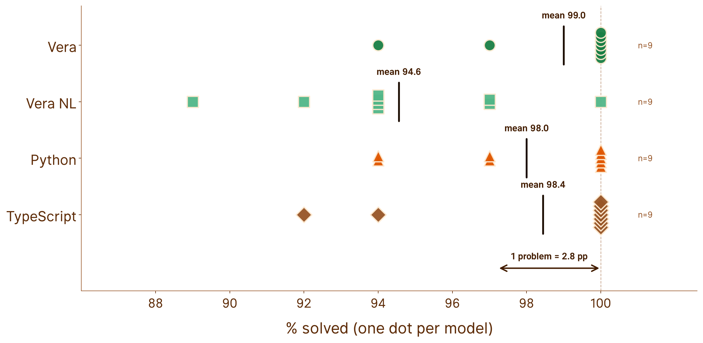

# VeraBench

[](https://veralang.dev)

[](https://github.com/aallan/vera-bench/actions/workflows/ci.yml)
[](https://codecov.io/gh/aallan/vera-bench)

A benchmark for evaluating LLM code generation in [Vera](https://github.com/aallan/vera), a programming language designed for large language models (LLMs) to write.

## Results

Models that have never seen Vera now write it about as well as they write
Python. Nine models, three providers, 60 problems across five difficulty tiers,
against [Vera v0.1.7](https://github.com/aallan/vera/releases/tag/v0.1.7).

### Vera against Python and TypeScript


Vera wins outright for four of the nine models, draws with three and loses two.
Where it wins, the margin is six to eight percentage points, which on 36 graded
problems is two or three problems.

The distribution matters more than the average. The wins are not spread across
the field; they belong to Claude Fable 5 and Claude Opus 5, and both losses to
Claude Opus 4.8 and Claude Sonnet 5. Everything interesting here is
happening inside one vendor's lineup, which is a caution against reading it as
a general property of frontier models.

### Full results

Each model runs the Vera problems twice, because there are two questions worth
asking.

The first run hands the model a full specification, meaning the type signature
and its contracts, and asks only for the body. That tests whether it can write
Vera. The second gives it the problem described in English and nothing more, so
it has to infer the types, author the contracts, and then write code that
satisfies them. That tests whether it understands Vera well enough to specify a
problem in it. The two columns below are those runs, and on the command line
they are the default and `--mode spec-from-nl`.

The distance between them measures what it costs a model to design a
specification rather than fill one in, and for most of the field that runs to
six or eight points. Two models close the gap completely, but Claude Opus 5 is
the only one that closes it at 100%. It writes the contracts as reliably as it
satisfies them.

| Model | Vera | Vera NL | Python | TypeScript |
|---|---|---|---|---|
| Claude Fable 5 | **100%** | 97% | 94% | 92% |
| GPT-5.6 Sol (pro) | **100%** | 92% | 97% | 100% |
| Claude Opus 5 | **100%** | **100%** | 94% | 94% |
| Claude Opus 4.8 | 94% | 94% | 100% | 100% |
| GPT-5.6 Sol | **100%** | 94% | 97% | 100% |
| Kimi K3 | **100%** | 97% | 100% | 100% |
| Claude Sonnet 5 | 97% | 89% | 100% | 100% |
| GPT-5.6 Terra | **100%** | 94% | 100% | 100% |
| Kimi K2.6 | **100%** | 94% | 100% | 100% |

The charts below are described in [assets/README.md](assets/README.md) along
with the command to regenerate them.

> **On reading the numbers.** The charts report **% solved**: the model wrote
> code, it compiled, it ran, and the output matched. A refusal, a compile
> failure, a crash and a wrong answer all count the same way, as not solved;
> the coverage chart is the exception, and counts problems instead. Single run
> per model, no pass@k. LLM output is non-deterministic and individual problems
> flip between runs. With 36 gradeable problems one problem is worth 2.8
> percentage points, so most of the gaps reported here are one or two problems
> wide.

### Across model generations


Three consecutive Claude flagships on the same 36 graded problems. Claude
Opus 4 solved fewer problems in Vera than in Python; Claude Opus 5 reverses
that.

Both Vera modes rise at every step, while Python and TypeScript end where they
started or below.

Only the second step is controlled. The first spans a compiler, a standard
library and a revision of the teaching document, so it measures the Vera
ecosystem improving alongside the models, in unknown proportion. The controlled
step moves the same way, which is suggestive rather than conclusive on a sample
of one transition.

### Reasoning mode


One model, two reasoning modes, the same problems. How the model reasons is the
only variable.

The model is GPT-5.6 Sol. OpenAI's Responses API takes a `reasoning.mode`
parameter, and the two runs set it to `standard` and to `pro`; nothing else
differs.

`reasoning.mode` is a separate axis from `reasoning.effort`. Mode picks which
execution path the model takes, standard or pro. Effort controls how much
reasoning it does once it is on that path. This chart varies mode and leaves
effort at its default, so what it measures is the more thorough execution path
rather than simply a longer think on the same one.

Nothing moves in any of the four languages. Whatever stops these models on the
last two or three problems is not something the pro path fixes, and that holds
in Python as firmly as in Vera. Vera's standing does not depend on the more
expensive execution path either, which matters because the pro entry is the
most costly run in the sweep. It is a null result, and null results on a
saturated benchmark are weak: there is very little room left for anything to
move.

### Refusals


There were five refusals across the whole run, every one of them in Python or
TypeScript and none in Vera. The problems were unremarkable, along the lines of
dividing two numbers and guarding against a zero divisor, and in each case the
same model went on to solve the same problem in four or five other languages.

All five came from Claude Fable 5 and Claude Opus 5, the two models in the
benchmark that ship cybersecurity classifiers. It is therefore likely that
these refusals are false positives from those guardrails rather than anything
to do with the problems themselves.

### What the headline metric cannot see


Every score reported above is computed over 36 of the 60 problems, the number
that carried test cases when this sweep ran. Most of the rest could not be
called at all: `vera run --fn` passes its arguments on a command line, and a
command line cannot carry a list or a tree. Python, TypeScript and AILANG
never had that limit, because the harness calls them from a generated wrapper
with the arguments written into the source. The few others sat out for their
own reasons: two string problems under an older compiler's argument handling,
and two IO problems whose multi-line output the cross-language baseline
protocol cannot host.

Vera now gets the same treatment
([#107](https://github.com/aallan/vera-bench/issues/107)): v0.0.17 took the
gradeable set to 46, and v0.0.18 closed it — all 60 problems are gradeable, in
all five languages. Reaching for the rest paid for itself immediately,
exposing seven canonical solutions that had shipped broken; `check` and
`verify` passed every one, and only running them caught them. The scores above
are still measured over the 36 problems gradeable when that sweep ran — the
last 24 are the ADT, pattern-matching and effect-handler problems, the ones
that exercise what makes Vera different from Python, so a re-sweep against
the full 60 is the next milestone.

### The benchmark is saturating



Every model against every language, one dot each. The whole field sits between
92% and 100% on the core languages, and all nine models reach 100% in at least
one of them. With 36 graded problems a single problem moves a score by 2.8
percentage points, so most of the gaps discussed above are one or two problems
wide.

This is the most serious limitation in this release. The benchmark can still
tell you that an unfamiliar language costs a model nothing, which is the
question it was built to answer, but it can no longer rank the field at the
top. The next version needs harder problems.

### A controlled comparison


Comparing Vera to Python confounds two variables: the languages differ in
design, and they differ enormously when it comes to training data. Python is
common in the training data of all the models, and Vera is entirely absent.

[Aver](https://github.com/jasisz/aver) is another language designed for models
to write, and it removes the second. It is statically typed, absent from every
training set, and learned from a single document in the prompt, exactly the
same as Vera.

The biggest design difference between the two languages is that Vera has no
variable names, using typed slot references. Vera scores higher on all five
models that ran both.

This is the strongest evidence so far that the biggest design gamble in Vera,
the use of typed De Bruijn indexing, is doing real work.

## Overview

VeraBench measures whether LLMs write better code in a language designed for them. Vera uses typed slot references instead of variable names, mandatory contracts, and explicit algebraic effects — all features that should make LLM-generated code more verifiable.

The benchmark covers five difficulty tiers:

| Tier | Focus | What it tests |
|------|-------|--------------|
| 1 | Pure arithmetic | Basic syntax, `@T.n` slot references, simple contracts |
| 2 | String & array ops | Built-in function discovery (`domain_verb` naming) |
| 3 | ADTs & match | Data type definition, De Bruijn indices in match arms |
| 4 | Recursion & termination | `decreases` clauses, Z3 verification |
| 5 | Multi-function & effects | IO, State, Exn, effect propagation across functions |

For each problem, we measure:

- **% solved (pass@1)** — The headline. Solved over the problems that can be
  output-graded, where a refusal, a compile failure, a runtime error and a
  wrong answer all count alike as not solved.
- **check@1** — Does the code pass `vera check` on first attempt?
- **verify@1** — Does it pass `vera verify` (Z3 contract verification)?
- **fix@1** — Given the error message, can the model fix it in one turn?
- **run_correct** — Does execution produce the correct output? Measured only
  over attempts that compiled, so it is not comparable across models that
  refuse or fail to compile at different rates. That is why the charts report
  % solved instead.

The same problems are also run in Python, TypeScript, [Aver](https://github.com/jasisz/aver), and [AILANG](https://ailang.sunholo.com/) as baselines. AILANG and Aver are zero-training-data languages, providing additional data points alongside Vera for the language-design-vs-training-data thesis.

> **Cross-language comparison:** For cross-language headline rates, use the T1–T4 aggregate. Tier 5 tests Vera's algebraic effect handlers, which other languages solve with fundamentally different native idioms. See [#50](https://github.com/aallan/vera-bench/issues/50).

## Prerequisites

* Python 3.11+
* Git
* Node.js 22+ *(optional, for TypeScript baselines and generation)*
* [Aver](https://github.com/jasisz/aver) *(optional, for Aver baselines and generation)*
* [AILANG](https://ailang.sunholo.com/) *(optional, for AILANG baselines and generation)*

## Installation

```bash
git clone https://github.com/aallan/vera-bench.git
cd vera-bench
python -m venv .venv
source .venv/bin/activate
pip install -e ".[llm]"
```

The `[llm]` extra installs the Anthropic and OpenAI SDKs. Use `pip install -e .` if you only need validation (no model evaluation).

### Install the Vera compiler

The `vera` command must be available on `$PATH`. Install it anywhere into the same environment, either from a local clone,

```bash
pip install -e /path/to/vera          
```

or directly from GitHub.

```bash
pip install git+https://github.com/aallan/vera.git   
```
Afterwards you should be able to print the Vera version from the terminal,

```bash
vera version   
```

this should return v0.1.6 or later. Vera 0.1.x changed several semantics the
benchmark depends on, so older compilers will fail validation.

## Running the benchmark

`vera-bench validate` checks all 60 problems and every canonical solution — run it first:

```bash
vera-bench validate
```

A single model against the Vera problems (full-spec mode) is one command:

```bash
export ANTHROPIC_API_KEY=sk-ant-...
vera-bench run --model claude-sonnet-5
```

`vera-bench run` writes one JSONL row per problem attempt to `results/`, and has **no resume** — it unlinks its output file at startup. It's the primitive; you don't drive a full multi-model run with it directly.

### The full sweep

A real run evaluates the whole model matrix — defined once in [`vera_bench/matrix.py`](vera_bench/matrix.py) and read by everything below — across every language target, and the workflow is shaped by the fact that LLM APIs are slow and flaky. Four scripts, used in order:

**1. Gate before you spend.** [`preflight.sh`](scripts/preflight.sh) checks every model id, provider auth, the request parameters each model accepts, and the Vera / Aver / AILANG toolchains — one problem per check. A couple of dollars against a sweep that is hours:

```bash
bash scripts/preflight.sh
```

**2. Run the sweep.** [`run_sweep.sh`](scripts/run_sweep.sh) runs the whole matrix (every model × its targets) in one terminal, provider streams concurrent. It is **idempotent**: it skips any target already on disk and clean and re-runs the rest, so a killed or rate-limited sweep is recovered simply by running it again. The expensive pro tier is opt-in:

```bash
export ANTHROPIC_API_KEY=... OPENAI_API_KEY=... MOONSHOT_API_KEY=...
SWEEP_INCLUDE_PRO=1 bash scripts/run_sweep.sh
```

Its terminal goes quiet mid-target — it pipes each run through `tee`, and the progress bar blanks when it's not on a real terminal. That's expected, not a hang; watch it with the next tool instead.

**3. Watch the scoreboard.** [`sweep_status.py`](scripts/sweep_status.py) reads the JSONL rows directly — the only reliable live signal — and separates a **transient** failure that should be re-run (rate-limit, timeout, empty content) from a **real result** that should be kept (a refusal, a compile error, a wrong answer):

```bash
SWEEP_INCLUDE_PRO=1 python scripts/sweep_status.py
```

**4. Repair transient failures surgically.** When a target is complete except for a few blips, [`rerun_failed.py`](scripts/rerun_failed.py) re-runs *only those problems* and splices them back, instead of re-running all 60 (drop `--apply` to preview):

```bash
python scripts/rerun_failed.py --model moonshot/kimi-k2.6 --mode full-spec --apply
```

Loop steps 3–4 until the scoreboard reads all-clean. See [`scripts/README.md`](scripts/README.md) for the full stage breakdown, env tunables, and the infrastructure-vs-model definition of "clean".

### Baselines

Canonical-solution reference runs — no model, no API key, one per comparison language:

```bash
vera-bench baselines                        # python (default)
vera-bench baselines --language typescript
vera-bench baselines --language aver
vera-bench baselines --language ailang
```

### Targeted runs

For iterating on one problem or mode rather than a full sweep:

```bash
vera-bench run --model claude-sonnet-5 --tier 1            # one tier
vera-bench run --model claude-sonnet-5 --problem VB-T1-001 # one problem
vera-bench run --model claude-sonnet-5 --mode spec-from-nl # agent writes its own contracts
vera-bench run --model claude-sonnet-5 --language python   # Python (or typescript/aver/ailang)
vera-bench run --model moonshot/kimi-k2.6 --parallel 10    # concurrent dispatch for slow models
```

Supported providers: [Anthropic](https://anthropic.com) (Claude), [OpenAI](https://openai.com) (GPT), [Kimi](https://platform.kimi.ai) (Moonshot), and [OpenRouter](https://openrouter.ai/). Set the matching key (`ANTHROPIC_API_KEY`, `OPENAI_API_KEY`, `MOONSHOT_API_KEY`, or `OPENROUTER_API_KEY`).

The Vera language reference ([SKILL.md](https://veralang.dev/SKILL.md)) is fetched from veralang.dev at run time. Use a local copy — e.g. for testing unreleased language features — with `--skill-md /path/to/SKILL.md`.

## Report generation

Running `vera-bench report results/` generates `results/summary.md` with a summary table, per-tier breakdowns, and per-problem detail. Each `vera-bench run` writes incremental JSONL results (one line per problem attempt), so a run that stops early is still reportable up to the problem it reached.

The headline chart comes from [`scripts/plot_results.py`](scripts/plot_results.py) — **% solved** (pass@1) per model × mode over the gradeable problem set. [`scripts/README.md`](scripts/README.md) documents it plus the 16:9 talk-slide renderer.

> **There is no resume.** `vera-bench run` deletes any existing output file for that model × language × mode before it starts, so re-running an interrupted target repeats it from problem 1 rather than topping it up. Filenames carry no timestamp, so the old results are gone. Budget a full re-run for any target that does not finish.

Results files are in `.gitignore` — they are generated artifacts, not checked in.

## Prior art

VeraBench is inspired by:

- [HumanEval](https://github.com/openai/human-eval) — 164 Python function completion problems
- [MBPP](https://github.com/google-research/google-research/tree/master/mbpp) — 974 Python problems from natural language
- [DafnyBench](https://github.com/sun-wendy/DafnyBench) — 782 Dafny verification annotation problems

DafnyBench demonstrated that tracking verification success rates over time attracts genuine research attention — success rates went from 68% to 96% across model generations in under two years. VeraBench aims to create the same longitudinal story for a language designed from scratch for LLM code generation.

## Citation

```bibtex
@software{verabench2026,
  author = {Allan, Alasdair},
  title = {VeraBench: a benchmark suite for LLM code generation in Vera},
  year = {2026},
  url = {https://github.com/aallan/vera-bench}
}
```

## License

VeraBench is licensed under the [MIT License](LICENSE).

Copyright © 2026 Alasdair Allan

Permission is hereby granted, free of charge, to any person obtaining a copy of this software and associated documentation files (the "Software"), to deal in the Software without restriction, including without limitation the rights to use, copy, modify, merge, publish, distribute, sublicense, and/or sell copies of the Software, and to permit persons to whom the Software is furnished to do so, subject to the following conditions:

The above copyright notice and this permission notice shall be included in all copies or substantial portions of the Software.

THE SOFTWARE IS PROVIDED "AS IS", WITHOUT WARRANTY OF ANY KIND, EXPRESS OR IMPLIED, INCLUDING BUT NOT LIMITED TO THE WARRANTIES OF MERCHANTABILITY, FITNESS FOR A PARTICULAR PURPOSE AND NONINFRINGEMENT. IN NO EVENT SHALL THE AUTHORS OR COPYRIGHT HOLDERS BE LIABLE FOR ANY CLAIM, DAMAGES OR OTHER LIABILITY, WHETHER IN AN ACTION OF CONTRACT, TORT OR OTHERWISE, ARISING FROM, OUT OF OR IN CONNECTION WITH THE SOFTWARE OR THE USE OR OTHER DEALINGS IN THE SOFTWARE.
